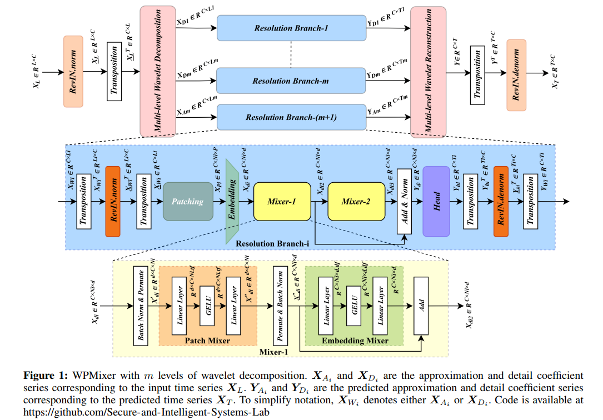
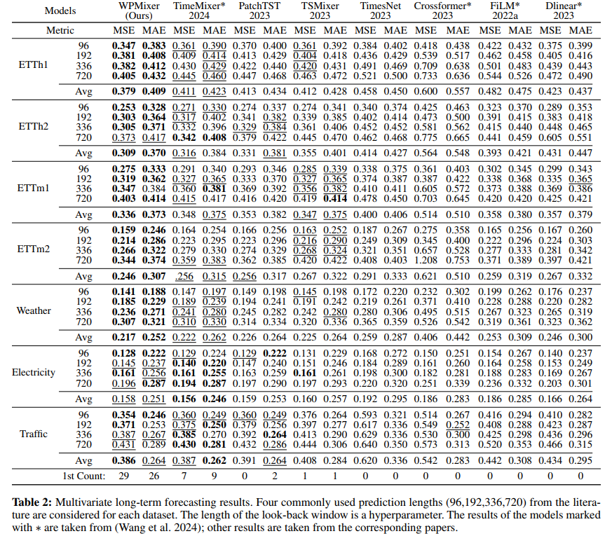
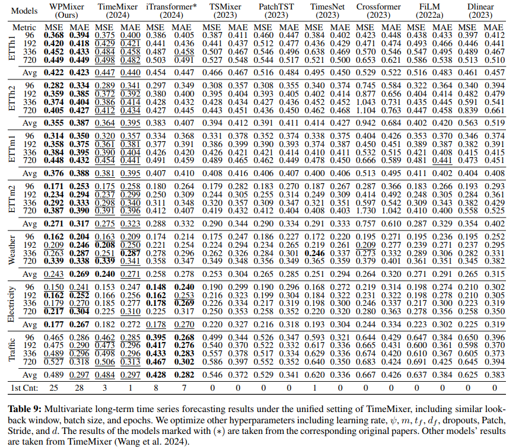
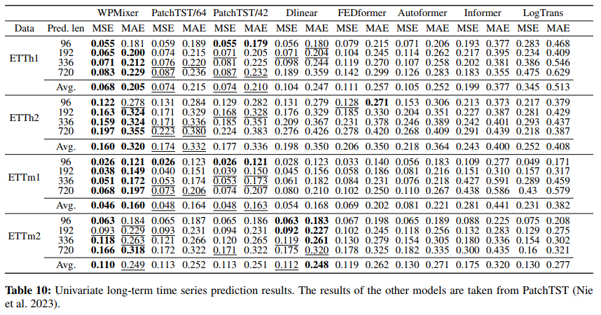

<h1 align="center">WPMixer: Efficient Multi-Resolution Mixing for Long-Term Time Series Forecasting</h1>

<div align="center">

<p><a href="https://arxiv.org/abs/2412.17176"><strong>Full Paper (ARXIV)</strong></a></p>

<hr style="border: 1px solid  #256ae2 ;">

<a href='https://arxiv.org/abs/2412.17176'></a> 


</div>


```bibtex
@inproceedings{murad2025wpmixer,
  title={Wpmixer: Efficient multi-resolution mixing for long-term time series forecasting},
  author={Murad, Md Mahmuddun Nabi and Aktukmak, Mehmet and Yilmaz, Yasin},
  booktitle={Proceedings of the AAAI Conference on Artificial Intelligence},
  volume={39},
  number={18},
  pages={19581--19588},
  year={2025}
}
```
## 🔄 Updates
- **[Nov 2025]** 🔥🔥🔥 Added full instructions for the optuna hyper-parameter tuning.
- **[May 2025]** Added a script for **hyperparameter tuning** using Optuna under `./scripts/HyperParameter_Tuning/`. These scripts explore optimal hyperparameter settings for ETT dataset.


## Get started
Follow these steps to get started with WPMixer:
### 1. Install Requirements
Install Python 3.10 and the necessary dependencies.

```bash
pip install -r requirements.txt
```
### 2. Download Data
<b>Process-1:</b>
Download the zip file of the datasets from the [link](https://usf.box.com/s/8ghqgtxfp1hw3rfvocr2s5gjf7w4x3ol).
Paste the zip file inside the <u>root folder</u> and extract. Now you will have ```./data/``` folder containing all the datasets.
 
Or, 
<b>Process-2:</b>
Download the data and locate them in the ```./data/``` folder. You can download all data from the public GitHub repo: [Autoformer](https://github.com/thuml/Autoformer) or [TimeMixer](https://github.com/kwuking/TimeMixer). All the datasets are well-pre-processed and can be used easily. To place and rename the datasets file, check the following folder tree,
```
data
├── electricity
│   └── electricity.csv
├── ETT
│   ├── ETTh1.csv
│   ├── ETTh2.csv
│   ├── ETTm1.csv
│   └── ETTm2.csv
├── exchange_rate
│   └── exchange_rate.csv
├── illness
│   └── national_illness.csv
├── m4
├── solar
│   └── solar_AL.txt
├── traffic
│   └── traffic.csv
└── weather
    └── weather.csv
```

    
### 3. Train the model
We provide the experiment scripts of all benchmarks under the folder ```./scripts/``` to reproduce the results. Running those scripts by the following commands will generate logs in the ```./logs/WPMixer/``` folder.

#### Multivariate long-term forecasting results with full hyperparameter search settings (Table-2):
```
bash ./scripts/Full_HyperSearch/ETTh1_full_hyp.sh
bash ./scripts/Full_HyperSearch/ETTh2_full_hyp.sh
bash ./scripts/Full_HyperSearch/ETTm1_full_hyp.sh
bash ./scripts/Full_HyperSearch/ETTm2_full_hyp.sh
bash ./scripts/Full_HyperSearch/Weather_full_hyp.sh
bash ./scripts/Full_HyperSearch/Electricity_full_hyp.sh
bash ./scripts/Full_HyperSearch/Traffic_full_hyp.sh
```

#### Multivariate long-term forecasting results with unified settings (Table-9 in Supplementary):
```
bash ./scripts/Unified/ETTh1_Unified_setup.sh
bash ./scripts/Unified/ETTh2_Unified_setup.sh
bash ./scripts/Unified/ETTm1_Unified_setup.sh
bash ./scripts/Unified/ETTm2_Unified_setup.sh
bash ./scripts/Unified/Weather_Unified_setup.sh
bash ./scripts/Unified/Electricity_Unified_setup.sh
bash ./scripts/Unified/Traffic_Unified_setup.sh
```
#### Univariate long-term forecasting results (Table-10 in Supplementary):
```
bash ./scripts/Univariate/ETTh1_univariate.sh
bash ./scripts/Univariate/ETTh2_univariate.sh
bash ./scripts/Univariate/ETTm1_univariate.sh
bash ./scripts/Univariate/ETTm2_univariate.sh
```
<br><br><br>

<hr style="border: 1px solid #FF5733;">
<h1 align="center" style="color: #256ae2 ;">🔥🔥A. HYPER-PARAMETER TUNING🔥🔥</h1>
<hr style="border: 1px solid #FF5733;">
Following explains how to run the hyper-tuning scripts for WPMixer, how to organize logs, how to specify datasets, and how each parameter works.

# A1. Overview
WPMixer supports automatic hyper-parameter optimization using Optuna.
You can run hyper-tuning for one or multiple datasets and automatically search over:
- Learning rates
- Sequence lengths
- Batch size
- Wavelet types
- Decomposition levels
- Patch lengths & strides
- Dropout choices
- Temporal expansion and embedding expansion factors

All results are logged under ./logs/WPMixer/.

# A2. Example of the Hyper-parameter Tuning Script:
Following script will also be found in ```./scripts/HyperParameter_Tuning/ETT_optuna_unified.sh```

```bash
if [ ! -d "./logs" ]; then
    mkdir ./logs
fi

if [ ! -d "./logs/WPMixer" ]; then
    mkdir ./logs/WPMixer
fi
export CUDA_VISIBLE_DEVICES=0

# General
model_name=WPMixer
task_name=long_term_forecast

python -u main_run2.py \
	--task_name $task_name \
	--model $model_name \
	--use_hyperParam_optim \
	--datasets ETTh1 ETTh2 \
	--pred_lens 192 \
	--loss smoothL1 \
	--use_amp \
	--n_jobs 1 \
	--optuna_lr 0.00001 0.01 \
	--optuna_batch 128 \
	--optuna_wavelet db2 db3 db5 sym2 sym3 sym4 sym5 coif4 coif5 \
	--optuna_seq_len 96 192 336 \
	--optuna_tfactor 3 5 7 \
	--optuna_dfactor 3 5 7 8 \
	--optuna_epochs 10 \
	--optuna_dropout 0.0 0.05 0.1 0.2 0.4 \
	--optuna_embedding_dropout 0.0 0.05 0.1 0.2 0.4 \
	--optuna_patch_len 16 \
	--optuna_stride 8 \
	--optuna_lradj type3 \
	--optuna_dmodel 128 256 \
	--optuna_weight_decay 0.0 \
	--optuna_patience 5 \
	--optuna_level 1 2 3 \
	--optuna_trial_num 200 >logs/WPMixer/ETTh_192_with_decomposition.log
```

# A3. Parameter Descriptions
This section explains every parameter used in the hyper-tuning script.

## General Parameters
| Parameter     | Description                                   |
| ------------- | --------------------------------------------- |
| `--task_name` | Task type (e.g., long_term_forecast).         |
| `--model`     | Model name (WPMixer).                         |
| `--loss`      | Loss function (smoothL1, MSE).                |
| `--use_amp`   | Enables automatic mixed precision for speed.  |
| `--datasets`  | One or multiple datasets to tune together.    |
| `--pred_lens` | Prediction horizon (e.g., 96).                |
| `--n_jobs`    | Number of parallel Optuna workers.            |

## Optuna Search Space Parameters
| Parameter                    | Description                                          |
| ---------------------------- | ---------------------------------------------------- |
| `--optuna_lr lr_min lr_max`  | Learning rate search interval from minimum LR to max.LR.                       |
| `--optuna_batch`             | Candidate batch sizes.                               |
| `--optuna_wavelet`           | Wavelet families for multi-resolution decomposition. Set a list of wavelet type to find the optimum one. |
| `--optuna_seq_len`           | Multiple input sequence lengths to find the optimum one.                     |
| `--optuna_tfactor`           | Multiple temporal mixing factors to find the optimum one.                              |
| `--optuna_dfactor`           | Multiple embedding mixing factors to find the optimum one.                         |
| `--optuna_epochs`            | Max epochs for each trial.                           |
| `--optuna_dropout`           | Multiple Dropout search values to find the optimum one.                               |
| `--optuna_embedding_dropout` | Multiple Embedding Dropout search values to find the optimum one.                     |
| `--optuna_patch_len`         | Length of each patch.              |
| `--optuna_stride`            | Stride between patches.                              |
| `--optuna_lradj`             | Learning rate scheduler policy.                      |
| `--optuna_dmodel`            | Multiple embedding dimensions to find the optimum one.                    |
| `--optuna_weight_decay`      | Weight decay coefficient for AdamW.                  |
| `--optuna_patience`          | Early stopping patience.                             |
| `--optuna_level`             | Multiple Wavelet Decomposition levels to find the optimum one.        |
| `--optuna_trial_num`         | Total number of Optuna trials.                       |

## ⚠️ Note (Important for WPMixer Hyper-Tuning)
When selecting ```optuna_patch_len``` and ```optuna_level```, ensure their compatibility with the effective sequence length at the deepest wavelet decomposition branch.
If you use $m$ levels in:
```
--optuna_level m
```
Then:
* The model uses $m$ detailed resolution branches
* And $1$ approximation branch
* The minimum effective sequence length among all detailed branches becomes: ```optuna_seq_len / 2^m```

To avoid invalid patching, you must satisfy: **(optuna_seq_len / 2^m) > optuna_patch_len**

Example:
```
optuna_seq_len = 96
optuna_level = 3   →   effective_seq_len = 96 / 8 = 12
optuna_patch_len = 16   ❌ invalid (12 < 16)
```


<br><br><br><br><br><br>


<hr style="border: 1px solid #FF5733;">
<h1 align="center" style="color: #256ae2 ;">B. Brief Overview of the Paper</h1>
<hr style="border: 1px solid #FF5733;">

# B1. Abstract:
Time series forecasting is crucial for various applications, such as weather forecasting, power load forecasting, and financial analysis. In recent studies, MLP-mixer models for time series forecasting have been shown as a promising alternative to transformer-based models. However, the performance of these models is still yet to reach its potential. In this paper, we propose Wavelet Patch Mixer (WPMixer), a novel MLP-based model, for long-term time series forecasting, which leverages the benefits of patching, multi-resolution wavelet decomposition, and mixing. Our model is based on three key components: (i) multi-resolution wavelet decomposition, (ii) patching and embedding, and (iii) MLP mixing. Multi-resolution wavelet decomposition efficiently extracts information in both the frequency and time domains. Patching allows the model to capture an extended history with a look-back window and enhances capturing local information while MLP mixing incorporates global information. Our model significantly outperforms state-of-the-art MLP-based and transformer-based models for long-term time series forecasting in a computationally efficient way, demonstrating its efficacy and potential for practical applications.

# B2. Model Architecture:  
<p align="center">
  
</p>

# B2. Multivariate Long-Term Forecasting Results with full hyperparameter searching:
<p align="center">
  
</p>

# B3. Multivariate Long-Term Forecasting under Unified Setting:
<p align="center">
  
</p>

# B4. Univariate Long-term forecasting result:
<p align="center">
  
</p>
